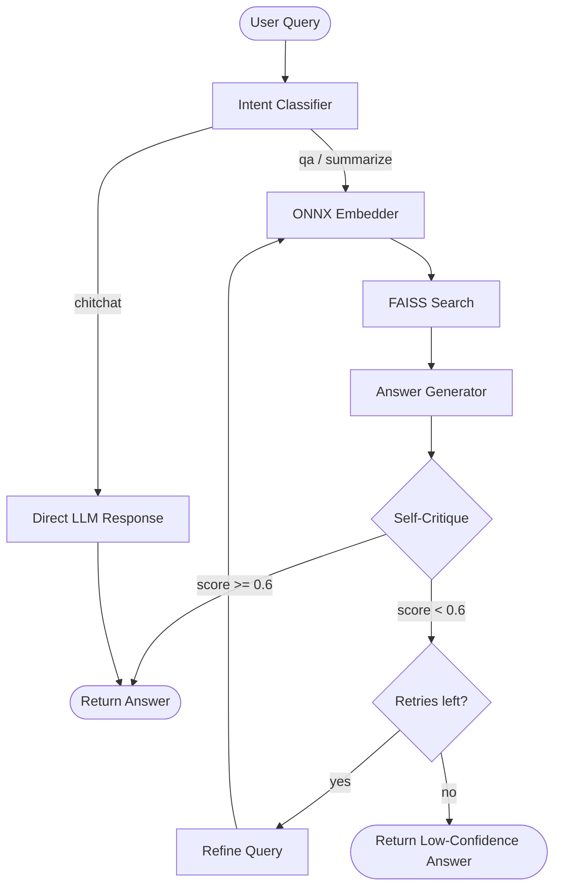
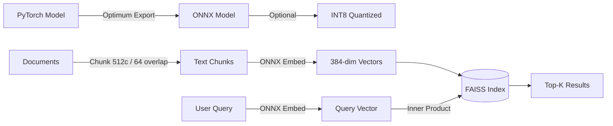
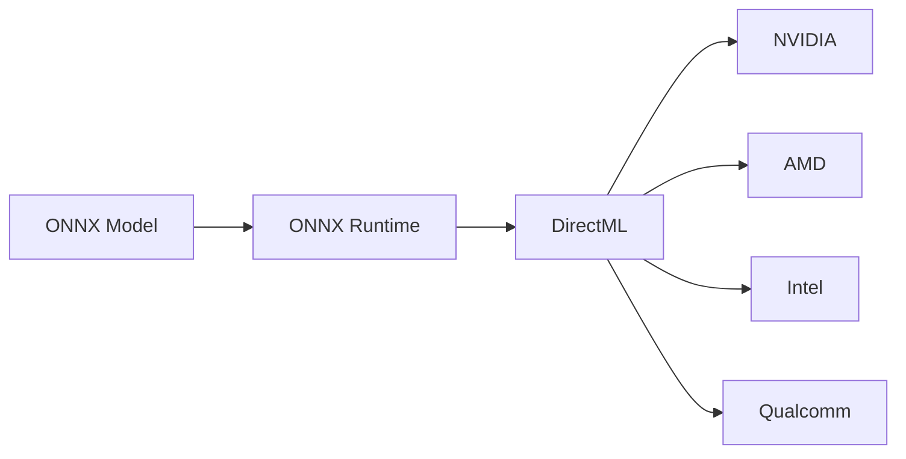

<div align="center">


# LocalMind AI

**A Fully Offline Agentic AI Assistant for Windows**

*Zero Cloud Dependency · DirectML GPU Acceleration · Self-Healing Retrieval*

<br/>

[](https://python.org)
[](https://fastapi.tiangolo.com)
[](https://onnxruntime.ai)
[](https://langchain-ai.github.io/langgraph/)
[](https://ollama.com)
[](https://docker.com)
[](LICENSE)

</div>

<br/>

> LocalMind is a lightweight agentic AI assistant that runs **entirely on your machine**. It accepts natural language queries, classifies intent using a locally hosted LLM, retrieves context through an ONNX-powered semantic search pipeline, and returns grounded answers — all without sending a single byte to the cloud.

<br/>

## How It Works



<br/>

## Architecture

```
┌─────────────────────────────────────────────────────────────────┐
│                        FastAPI Server                           │
│                   POST /ask  ·  POST /ingest                    │
│                   GET /health  ·  GET /stats                    │
├─────────────────────────────────────────────────────────────────┤
│                                                                 │
│   ┌───────────┐    ┌──────────────┐    ┌───────────────────┐   │
│   │  Intent    │    │   Context    │    │     Answer        │   │
│   │ Classifier │───▶│  Retriever   │───▶│   Generator       │   │
│   └───────────┘    └──────────────┘    └────────┬──────────┘   │
│        │                  ▲                      │              │
│        │                  │                      ▼              │
│        │           ┌──────┴──────┐      ┌──────────────┐       │
│        │           │   Query     │◀─────│ Self-Critique │       │
│        │           │  Refiner    │      │    Engine     │       │
│        │           └─────────────┘      └──────────────┘       │
│        │                                                        │
│        ▼                                                        │
│   ┌──────────────────────────────────────────────────────────┐  │
│   │              LangGraph StateGraph Orchestration           │  │
│   └──────────────────────────────────────────────────────────┘  │
│                                                                 │
├──────────────────┬──────────────────┬───────────────────────────┤
│   Ollama LLM     │   ONNX Runtime   │     FAISS Index          │
│   (Mistral 7B)   │   (DirectML GPU)  │  (Vector Search)        │
│   localhost:11434 │   all-MiniLM-L6  │   IndexFlatIP           │
└──────────────────┴──────────────────┴───────────────────────────┘
```

<br/>

## The Self-Critique Loop

The agent doesn't just answer — it **judges its own output** and iteratively improves.

```
         ┌──────────────────────────────────────────────┐
         │              Scoring Rubric                   │
         ├──────────────┬─────────┬─────────────────────┤
         │  Dimension   │ Weight  │  What it measures    │
         ├──────────────┼─────────┼─────────────────────┤
         │  Relevance   │  40%    │  Addresses question? │
         │  Groundedness│  40%    │  Backed by context?  │
         │  Completeness│  20%    │  Covers all aspects? │
         └──────────────┴─────────┴─────────────────────┘

         Score = 0.4×relevance + 0.4×groundedness + 0.2×completeness

         If score < 0.6 → refine query → re-retrieve → re-generate
         Max 2 retries before returning low-confidence answer
```

<br/>

## Quick Start

### Docker (Recommended)

```bash
git clone https://github.com/Nagendramanthena/localmind-ai.git
cd localmind-ai
docker-compose up --build
```

That's it. Ollama + the agent start automatically. Test with:

```bash
curl -X POST http://localhost:8000/ask \
  -H "Content-Type: application/json" \
  -d '{"query": "What is deep learning?"}'
```

### Native Windows

**Prerequisites:** Python 3.11+ · [Ollama](https://ollama.com/download/windows) · DirectX 12 GPU *(optional)*

```bash
# 1. Setup
python -m venv .venv && .venv\Scripts\activate
pip install -r requirements.txt
ollama pull mistral:7b

# 2. For GPU acceleration (optional)
pip uninstall onnxruntime && pip install onnxruntime-directml

# 3. Export embedding model to ONNX
pip install -r requirements-export.txt
python scripts/export_model.py

# 4. Build search index
python scripts/build_index.py

# 5. Run
copy .env.example .env
uvicorn app.main:app --host 0.0.0.0 --port 8000
```

<br/>

## API

### `POST /ask` — Query the agent

```bash
curl -X POST http://localhost:8000/ask \
  -H "Content-Type: application/json" \
  -d '{"query": "What is machine learning?", "top_k": 5}'
```

Response:

```json
{
  "answer": "Machine learning is a subset of AI that enables systems to learn from experience...",
  "intent": "qa",
  "confidence": 0.87,
  "sources": ["machine_learning.md"],
  "retries_used": 0,
  "critique": {
    "relevance": 0.92,
    "groundedness": 0.88,
    "completeness": 0.78,
    "feedback": "Comprehensive coverage of definition and types."
  }
}
```

### `POST /ingest` — Add documents at runtime

```bash
curl -X POST http://localhost:8000/ingest \
  -H "Content-Type: application/json" \
  -d '{"texts": ["New document content..."], "metadata": [{"source": "doc.md"}]}'
```

### `GET /health` · `GET /stats`

```bash
curl http://localhost:8000/health
# → {"status": "healthy", "ollama": true, "onnx": true, "index_size": 42}

curl http://localhost:8000/stats
# → {"index_size": 42, "embedding_dimension": 384, "ollama_model": "mistral:7b", ...}
```

<br/>

## Embedding Pipeline



<br/>

## DirectML GPU Support

ONNX Runtime + DirectML gives **hardware-agnostic** GPU acceleration on Windows:



```bash
pip uninstall onnxruntime
pip install onnxruntime-directml
# Set ONNX_PROVIDERS=auto in .env — it auto-detects
```

<br/>

## Project Structure

```
localmind-ai/
├── app/
│   ├── main.py                    # FastAPI endpoints
│   ├── config.py                  # Settings from .env
│   ├── agent/
│   │   ├── graph.py               # LangGraph workflow
│   │   ├── nodes.py               # Node functions
│   │   └── prompts.py             # Tunable prompt templates
│   ├── models/
│   │   ├── schemas.py             # Request/response models
│   │   └── state.py               # Agent state definition
│   ├── services/
│   │   ├── embedding_service.py   # ONNX inference + DirectML
│   │   ├── llm_service.py         # Ollama wrapper
│   │   └── retrieval_service.py   # FAISS search + persistence
│   └── utils/
│       └── logging.py             # Structured logging
├── scripts/
│   ├── export_model.py            # PyTorch → ONNX export
│   └── build_index.py             # Document ingestion
├── data/documents/                # Knowledge base files
├── models/onnx/                   # Exported ONNX model
├── Dockerfile                     # Multi-stage (no PyTorch in runtime)
├── docker-compose.yml             # Ollama + Agent
├── requirements.txt
├── requirements-export.txt
└── .env.example
```

<br/>

## Configuration

| Variable | Default | Description |
|:---|:---|:---|
| `OLLAMA_BASE_URL` | `http://localhost:11434` | Ollama server URL |
| `OLLAMA_MODEL` | `mistral:7b` | LLM model name |
| `EMBEDDING_MODEL_PATH` | `./models/onnx` | ONNX model directory |
| `ONNX_PROVIDERS` | `auto` | `auto` · `DmlExecutionProvider` · `CPUExecutionProvider` |
| `FAISS_INDEX_PATH` | `./data/index` | Index storage path |
| `TOP_K` | `5` | Chunks per retrieval |
| `CONFIDENCE_THRESHOLD` | `0.6` | Self-critique pass threshold |
| `MAX_RETRIES` | `2` | Re-retrieval attempts |
| `CHUNK_SIZE` | `512` | Document chunk size |
| `CHUNK_OVERLAP` | `64` | Chunk overlap |
| `LOG_LEVEL` | `INFO` | Logging level |

<br/>

## Docker Setup

The Dockerfile uses a **multi-stage build** to keep the runtime image lean:

| Stage | Contains | Size |
|:---|:---|:---|
| **Builder** | PyTorch + Optimum → exports ONNX model | ~4 GB (discarded) |
| **Runtime** | ONNX Runtime + FastAPI + FAISS | ~1.2 GB |

`docker-compose.yml` runs three services:

| Service | Role | Port |
|:---|:---|:---|
| `ollama` | Local LLM server | 11434 |
| `ollama-init` | Pulls `mistral:7b` on first run | — |
| `agent` | FastAPI application | 8000 |

<br/>

## Troubleshooting

| Problem | Fix |
|:---|:---|
| `No .onnx file found` | Run `python scripts/export_model.py` |
| Ollama connection refused | Run `ollama serve` |
| Empty search results | Run `python scripts/build_index.py` |
| DirectML not detected | Auto-falls back to CPU |
| Out of GPU memory | Switch to `phi3:mini` |
| Slow first request | Normal — one-time ONNX graph compilation |

<br/>

---

<div align="center">

**Built for fully offline AI · Your data never leaves your machine**

MIT License

</div>
