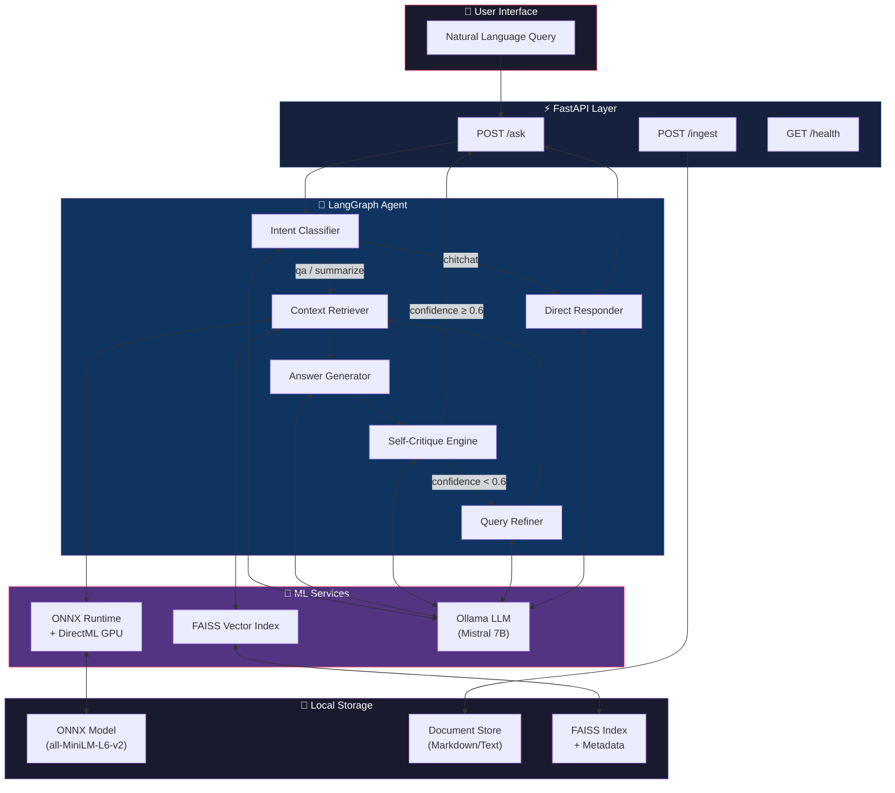
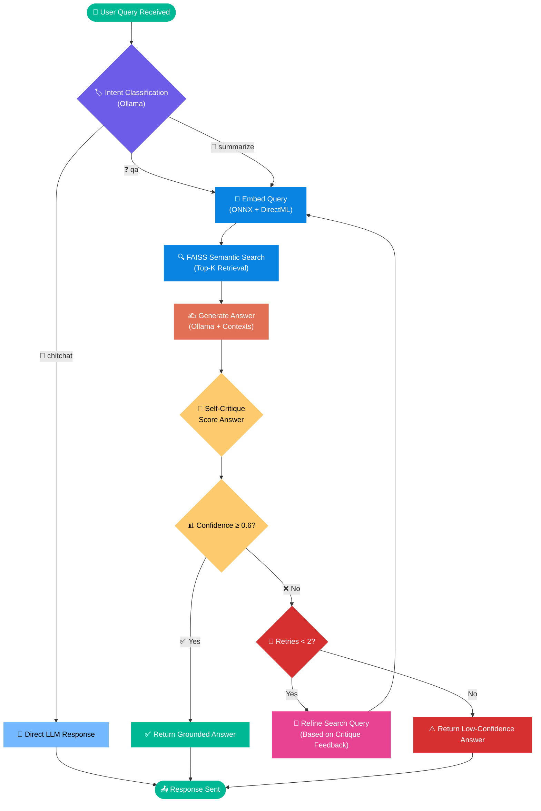
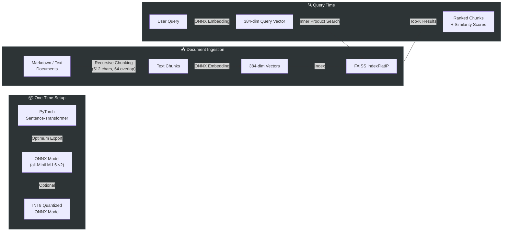
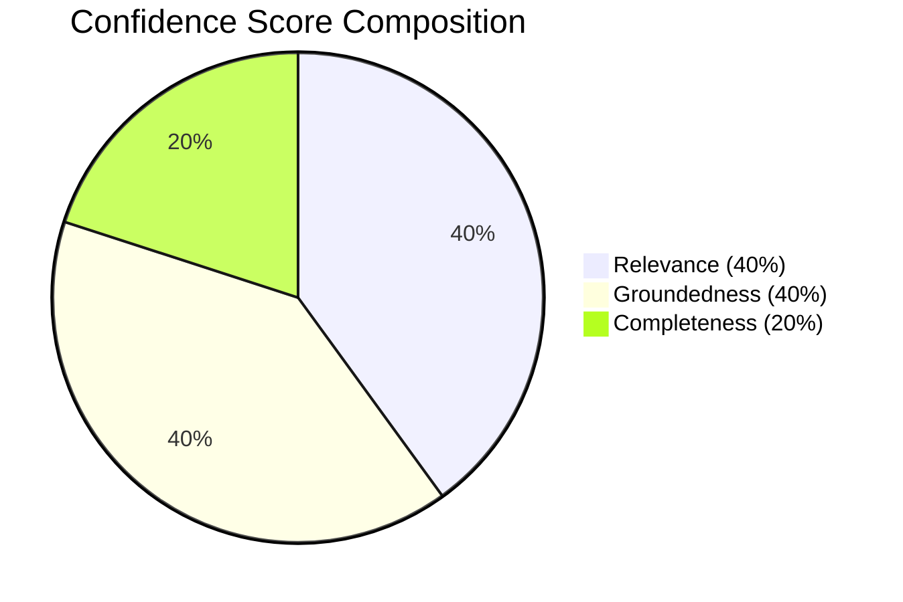
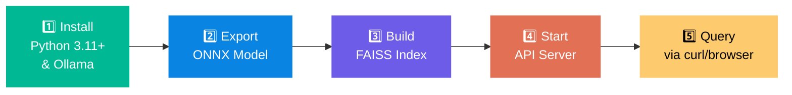
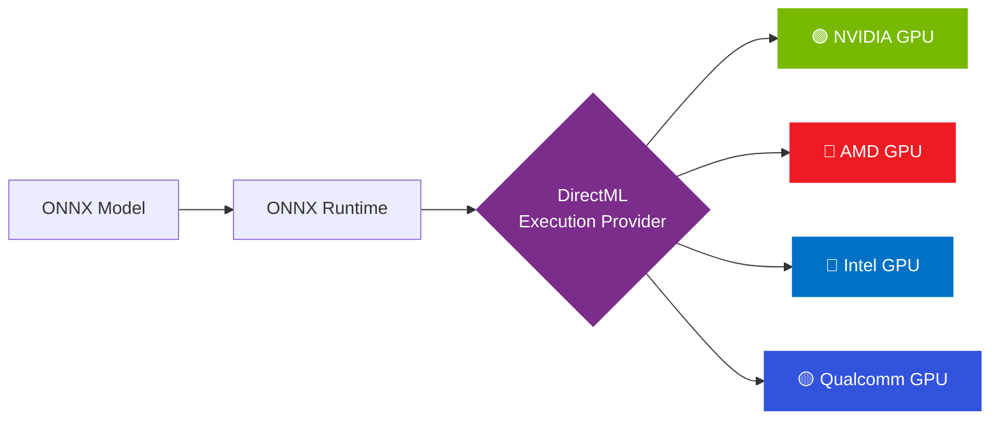
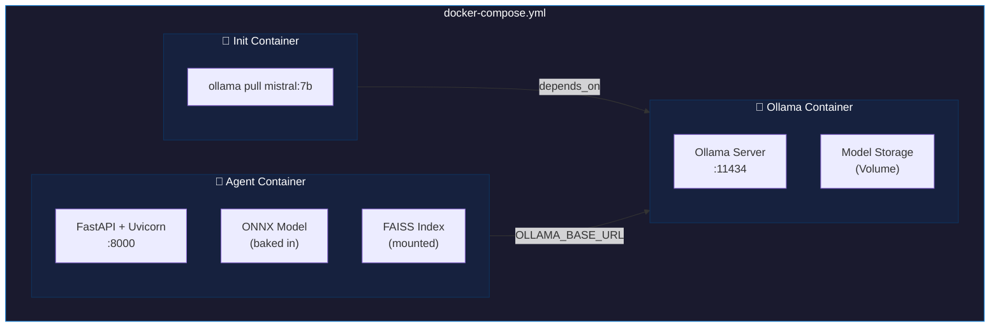

<](https://python.org)
[](https://fastapi.tiangolo.com)
[](https://onnxruntime.ai)
[](https://langchain-ai.github.io/langgraph/)
[](https://ollama.com)
[](https://docker.com)

---

*LocalMind is a lightweight agentic AI assistant that runs **entirely on your machine**. It accepts natural language queries, classifies intent using a locally hosted LLM, retrieves context through an ONNX-powered semantic search pipeline, and returns grounded answers — all without sending a single byte to the cloud.*

</div>

---

## 🏗️ System Architecture



---

## 🔄 Agent Workflow — The Self-Critique Loop

This is the core intelligence of LocalMind. The agent doesn't just generate answers — it **judges its own output** and iteratively improves until confidence is high enough.



---

## 🧮 Embedding & Retrieval Pipeline



---

## 📊 Self-Critique Scoring Rubric

The agent evaluates every generated answer before returning it:



| Dimension | Weight | Score Range | Description |
|:---|:---:|:---:|:---|
| **Relevance** | 40% | 0.0 – 1.0 | Does the answer directly address the question? |
| **Groundedness** | 40% | 0.0 – 1.0 | Is every claim supported by retrieved context? |
| **Completeness** | 20% | 0.0 – 1.0 | Does it cover all answerable aspects? |

> **Threshold:** If `weighted_score < 0.6`, the agent refines its search query using the critique feedback and re-retrieves (up to 2 retries).

---

## 🚀 Quick Start

### Option A: Docker (Recommended)

```bash
# Clone the repository
git clone https://github.com/Nagendramanthena/localmind-ai.git
cd localmind-ai

# Start everything (Ollama + Agent API)
docker-compose up --build

# Test it!
curl -X POST http://localhost:8000/ask \
  -H "Content-Type: application/json" \
  -d '{"query": "What is deep learning?"}'
```

### Option B: Native Windows Setup



#### Step 1: Install Dependencies

```bash
# Create virtual environment
python -m venv .venv
.venv\Scripts\activate

# Install runtime dependencies
pip install -r requirements.txt

# For DirectML GPU acceleration (Windows only):
pip uninstall onnxruntime
pip install onnxruntime-directml

# Install and start Ollama, then pull the model
ollama pull mistral:7b
```

#### Step 2: Export Embedding Model to ONNX

```bash
pip install -r requirements-export.txt
python scripts/export_model.py            # Standard export
python scripts/export_model.py --quantize  # With INT8 quantization
```

#### Step 3: Build the Search Index

```bash
python scripts/build_index.py                       # Index sample docs
python scripts/build_index.py --docs /path/to/docs   # Index your own docs
```

#### Step 4: Start the Server

```bash
copy .env.example .env    # Edit configuration as needed
uvicorn app.main:app --host 0.0.0.0 --port 8000
```

---

## 📡 API Reference

### `POST /ask` — Query the Agent

```bash
curl -X POST http://localhost:8000/ask \
  -H "Content-Type: application/json" \
  -d '{"query": "What is machine learning?", "top_k": 5}'
```

<details>
<summary>📋 Example Response</summary>

```json
{
  "answer": "Machine learning (ML) is a subset of artificial intelligence that enables systems to learn and improve from experience without being explicitly programmed. According to the knowledge base, it focuses on developing programs that can access data and learn for themselves. There are three main types: Supervised Learning (trained on labeled data), Unsupervised Learning (finds patterns in unlabeled data), and Reinforcement Learning (learns through rewards).",
  "intent": "qa",
  "confidence": 0.87,
  "sources": ["machine_learning.md"],
  "retries_used": 0,
  "critique": {
    "relevance": 0.92,
    "groundedness": 0.88,
    "completeness": 0.78,
    "feedback": "Answer comprehensively covers the definition and types. Could mention deep learning as a subset."
  }
}
```

</details>

### `POST /ingest` — Add Documents at Runtime

```bash
curl -X POST http://localhost:8000/ingest \
  -H "Content-Type: application/json" \
  -d '{"texts": ["Your new document content..."], "metadata": [{"source": "new_doc.md"}]}'
```

### `GET /health` — Health Check

```bash
curl http://localhost:8000/health
# {"status": "healthy", "ollama": true, "onnx": true, "index_size": 42}
```

### `GET /stats` — Index Statistics

```bash
curl http://localhost:8000/stats
# {"index_size": 42, "embedding_dimension": 384, "ollama_model": "mistral:7b", ...}
```

---

## 📁 Project Structure

```
localmind-ai/
├── 📂 app/
│   ├── main.py                    # FastAPI entry point & endpoints
│   ├── config.py                  # Centralized settings (from .env)
│   ├── 📂 agent/
│   │   ├── graph.py               # LangGraph StateGraph wiring
│   │   ├── nodes.py               # All graph node functions
│   │   └── prompts.py             # Prompt templates (easily tunable)
│   ├── 📂 models/
│   │   ├── schemas.py             # Pydantic API request/response models
│   │   └── state.py               # LangGraph shared state definition
│   ├── 📂 services/
│   │   ├── embedding_service.py   # ONNX Runtime inference (DirectML)
│   │   ├── llm_service.py         # Ollama LLM wrapper
│   │   └── retrieval_service.py   # FAISS vector search + persistence
│   └── 📂 utils/
│       └── logging.py             # Structured logging (structlog)
├── 📂 scripts/
│   ├── export_model.py            # PyTorch → ONNX export
│   └── build_index.py             # Document → FAISS ingestion
├── 📂 data/
│   ├── 📂 documents/              # Knowledge base (markdown/text files)
│   └── 📂 index/                  # Persisted FAISS index + metadata
├── 📂 models/
│   └── 📂 onnx/                   # Exported ONNX model + tokenizer
├── Dockerfile                     # Multi-stage build (no PyTorch in runtime!)
├── docker-compose.yml             # Ollama sidecar + Agent API
├── requirements.txt               # Runtime Python dependencies
├── requirements-export.txt        # Export-only deps (PyTorch, Optimum)
├── .env.example                   # Configuration template
└── README.md
```

---

## ⚙️ Configuration

All settings are controlled via environment variables or a `.env` file:

| Variable | Default | Description |
|:---|:---|:---|
| `OLLAMA_BASE_URL` | `http://localhost:11434` | Ollama server URL |
| `OLLAMA_MODEL` | `mistral:7b` | LLM model for intent/generation/critique |
| `EMBEDDING_MODEL_PATH` | `./models/onnx` | Path to exported ONNX model |
| `ONNX_PROVIDERS` | `auto` | `auto` / `DmlExecutionProvider` / `CPUExecutionProvider` |
| `FAISS_INDEX_PATH` | `./data/index` | FAISS index persistence directory |
| `TOP_K` | `5` | Context chunks per retrieval |
| `CONFIDENCE_THRESHOLD` | `0.6` | Self-critique pass/fail threshold |
| `MAX_RETRIES` | `2` | Max re-retrieval attempts on low confidence |
| `CHUNK_SIZE` | `512` | Document chunk size (characters) |
| `CHUNK_OVERLAP` | `64` | Overlap between consecutive chunks |
| `LOG_LEVEL` | `INFO` | `DEBUG` / `INFO` / `WARNING` / `ERROR` |

---

## 🖥️ DirectML GPU Acceleration (Windows)

LocalMind uses ONNX Runtime with **DirectML** for hardware-agnostic GPU acceleration on Windows:



**Setup:**
```bash
pip uninstall onnxruntime
pip install onnxruntime-directml
```

> Works with **any DirectX 12 capable GPU**. Set `ONNX_PROVIDERS=auto` and LocalMind auto-detects DirectML on Windows, falling back to CPU elsewhere.

---

## 🐳 Docker Architecture



The Dockerfile uses a **multi-stage build**:
- **Stage 1 (builder):** Includes PyTorch + Optimum → exports ONNX model
- **Stage 2 (runtime):** Lean image (~1.2 GB) with only ONNX Runtime, no PyTorch

---

## 🔧 Troubleshooting

| Issue | Solution |
|:---|:---|
| `No .onnx file found` | Run `python scripts/export_model.py` first |
| `Connection refused` to Ollama | Start Ollama: `ollama serve` |
| Empty search results | Build the index: `python scripts/build_index.py` |
| DirectML not detected | Falls back to CPU automatically; check DirectX 12 support |
| Out of GPU memory | Use a smaller LLM: `ollama pull phi3:mini` |
| Slow first request | Normal — ONNX graph compilation on first inference |

---

## 📄 License

MIT — use it however you like.

---

<div align="center">

**Built with ❤️ for fully offline AI**

*Your data never leaves your machine.*

</div>
]]>
